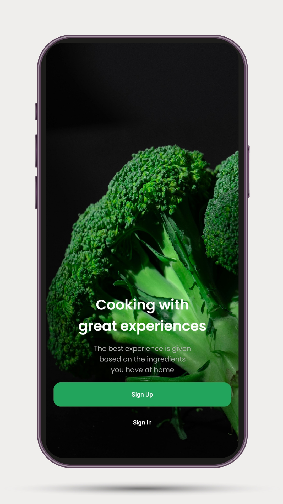
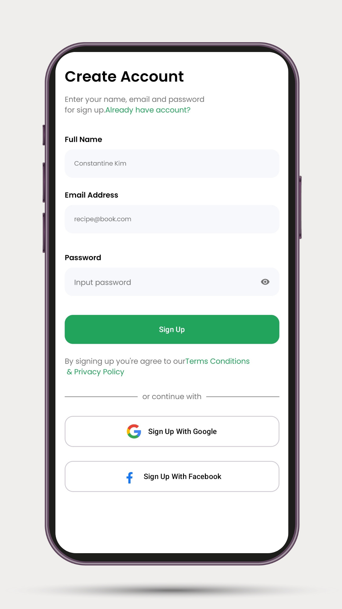
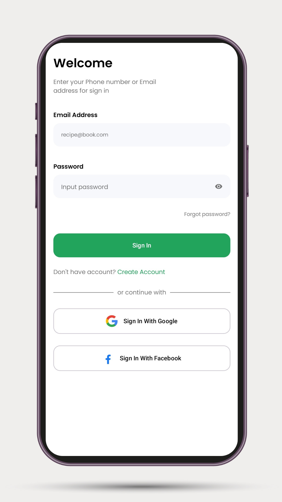
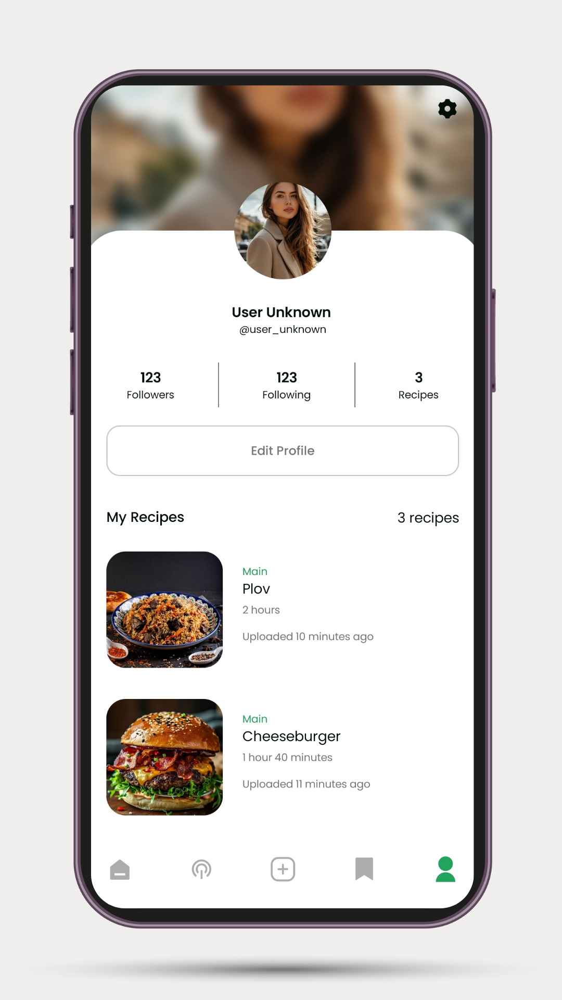
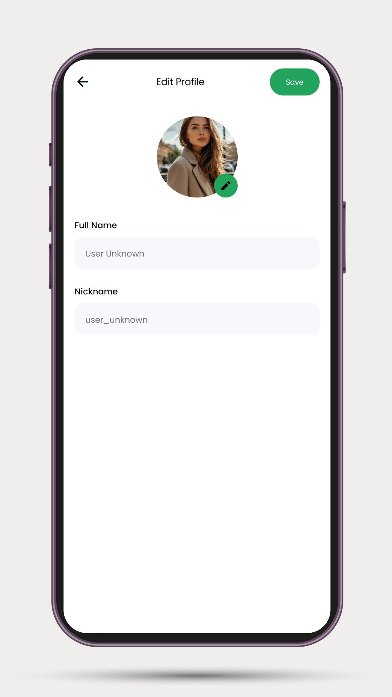

# **📱 RecipeBook — Android Pet Project**

**RecipeBook** — Android-приложение для хранения и обмена кулинарными рецептами.

## 📱 Screenshots

<p align="center">
    
    
    
    
    
</p>

Проект разработан как **пет-проект для портфолио Android-разработчика** с фокусом на **современный
Android-стек, чистую архитектуру и best practices**.

---

## **Что реализовано**

- Авторизация через **Email/Password (Firebase Authentication)**

- Профиль пользователя

- Загрузка изображений профиля

- Поддержка светлой и тёмной темы

- Поддержка нескольких языков

- Загрузка пользовательских данных (Рецепт)

- Получение пользовательских данных (Рецепт)

---

## **Архитектура и подход**

Проект построен с использованием **Clean Architecture + MVVM**.

- UI слой реализован на **Jetpack Compose**

- Domain слой не зависит от Android SDK

- Firebase используется только в data-слое

- Логика разделена на интеракторы (use cases)

- Используются **State + Flow** для управления состоянием

---

## **🛠️ Технологический стек**

- **Kotlin**

- **Jetpack Compose**

- **Material 3**

- **MVVM**

- **Hilt/Dagger2 (Dependency Injection)**

- **Coroutines / Flow**

- **Firebase**

    - Authentication

    - Firestore

    - Storage

- **Navigation Compose**

- **DataStore**

- **Coil**

---

## **⚙️ Firebase setup**

Файл google-services.json не хранится в репозитории по соображениям безопасности.

Чтобы запустить проект локально:

1. Создайте проект в Firebase Console

   https://console.firebase.google.com

2. Добавьте Android-приложение

3. Используйте applicationId из app/build.gradle

4. Загрузите google-services.json

5. Поместите файл в директорию app/

---

## **⚙️ Запуск проекта**

```
git clone https://github.com/sandpaper-hub/RecipeBook
```

1. Откройте проект в **Android Studio**

2. Добавьте google-services.json

3. В Firebase включите:

    - Authentication (Email/Password)

    - Firestore Database

    - Firebase Storage

4. Запустите проект на эмуляторе или устройстве

---

## **🧪 В планах развития**

- Создание/редактирование рецептов

- Поиск и фильтрация рецептов

- Комментарии

- Push-уведомления

- Избранные рецепты

- Unit-тесты

---

## **👨‍💻 О проекте**

Проект создан с целью:

- практики современной Android-разработки

- демонстрации архитектурного мышления